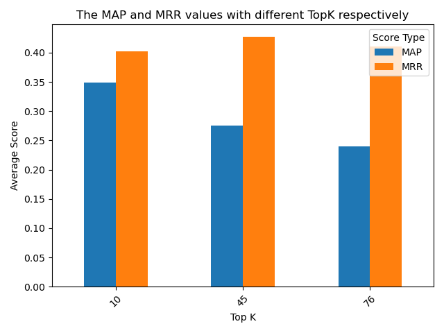
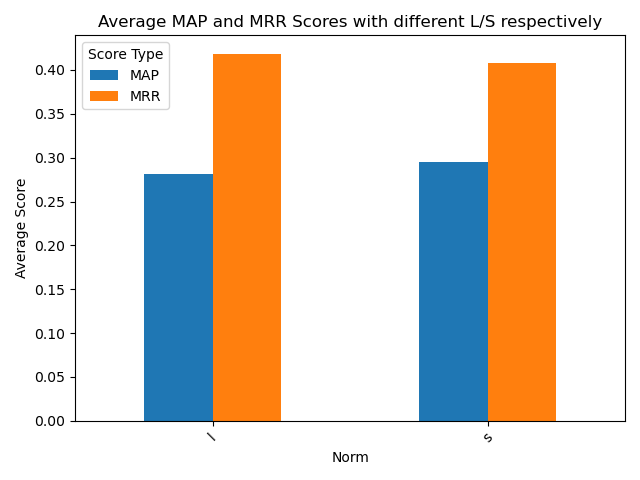
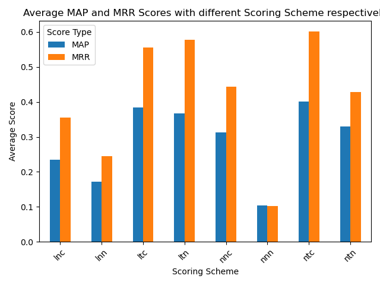
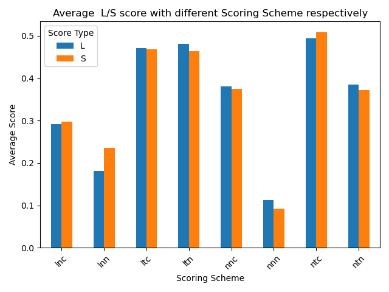

# Evaluation Report

## Introduction

### Scoring Parameters
Scoring parameters play a pivotal role in the relevance determination process within an information retrieval system. These parameters include:

- **Term Frequency (tf):** Measures how frequently a term occurs in a document. It can take various forms such as natural frequency (n), logarithmic (l), augmented (a), boolean (b), and log average (L). This reflects the importance of term occurrence for relevance.

- **Document Frequency (df):** Counts how many documents contain the term. It is often transformed into inverse document frequency (idf) with variations like no idf (n), "standard" idf (t), and probabilistic (p) to account for the term's rarity across the collection.

- **Normalization (n):** Techniques like none (n), cosine (u), and byte size (b) are used to correct for document length, ensuring that longer documents do not overshadow shorter ones in relevance due to sheer size.

### Evaluation Metrics
Evaluation metrics are essential for gauging the performance of search systems:


- **Mean Average Precision (MAP):** The mean of the precision scores calculated at the ranks where each relevant document is found, averaged across all queries.

- **Mean Reciprocal Rank (MRR):** An average of the reciprocal of the ranks at which the first relevant document is retrieved across all queries.

The implementation and refinement of these metrics are paramount in developing retrieval systems that can efficiently serve user needs by delivering relevant and quality results.


## Methodology

To identify the best configuration for our information retrieval system, we will conduct an experiment using `evaluation.py` to test various combinations of scoring schemes across a set of queries. This experiment aims to measure which scoring schemes yield the highest Mean Average Precision (MAP) and Mean Reciprocal Rank (MRR). Our methodology involves several steps:

### 1. Preparation

- Ensure `build_index.py` has been successfully run on the `CISI_simplified` collection to create the inverted index.
  ```bash
  python3 ./code/build_index.py CISI_simplified
  ```
- Call `test.py` , where it is under the `code` document.
  ```bash
  python3 ./test/test.py
  ```
  This script can return numbers of `.json ` files, which are named by `evaluation_results(n=).json`,and `command(n=).json`.
  The n value is defined by the number of avaiable queries in the `CISI_simplified.QRY`.

  `Parameters` from this test.py:    
  
  - the n value is `20`,`40`,`60`,`76`.  
  - The topK value is `10`,`45`,`76`.    
  - Scoring Scheme is `nnn`, `ltn`, `lnn`, `ntn`, `nnc`, `ltc`, `lnc`, and `ntc`.  
  - norm is `l`,`s`.  
  - Metrics is `MAP`,`MRR`.  
  
### 2. Find the Best Configuration

- Find The MAP and MRR values with different TopK respectively
- Find The MAP MMR values with different L/S values respectively
- Find The MAP and MMR with different Scoring Scheme respectively
- Find L/S values with different scoring scheme respectively


## Result


### 1. Result of Different Configuration

#### 1.The MAP and MRR values with different TopK respectively. 
   
- From the plot of the topK values, we observe that as the number of topK increases, the patterns of `MAP`  values decrease.  
- And as the number of topK increases, the patterns of `MMR` increase slightly before it reaches the highest value at `topK = 45`,then the `MMR` values decrease slightly.  
- Therefore, we can conclude that higher topK values correlate with lower `MAP`  values. 
We can use `topk = 10`,which is the highest topK in the test values for `MAP`, and use `topK = 45` for `MMR`.

#### 2. The MAP MMR values with different L/S values respectively
   
- For both norm L and S, the MRR score is higher than the MAP score.
- The norm S has a slightly higher MAP score compared to norm L. On the other hand, norm L has a higher MRR score than norm S.


#### 3.The MAP and MMR with different Scoring Scheme respectively
 
- The scoring schemes are labeled 'lnc', 'lnn', 'ltc', 'ltn', 'nnc', 'nnn', 'ntc', and 'ntn'.
- The MRR score is consistently higher than the MAP score across all scoring schemes.
- The 'ntn' scoring scheme has the highest MRR score.
- The 'ntn' scoring scheme also has the highest MAP score.
- The 'nnc' scoring scheme has the lowest MAP and MRR scores.
- There is a general trend that 'nt' prefixed schemes perform better than 'ln' and 'nn' prefixed schemes for both MAP and MRR scores.
- If you are optimizing for the highest Mean Reciprocal Rank (MRR), which is typically concerned with the ranking of the first correct answer, the `ntc` scoring scheme is the best since it has the highest MRR score.  
If you are optimizing for the highest Mean Average Precision (MAP), which considers the precision across all levels of recall, the `ntc` scoring scheme is again the best since it also has the highest MAP score.
- Therefore, the `ntc` scoring scheme would be the optimal choice according to the graph, as it performs best for both MAP and MRR scores.

#### 4. L/S values with different scoring scheme respectively

- This plot shows two patterns of `L` and `S` normalization, it shows each pattern with different Scoring Scheme `'lnc', 'lnn', 'ltc', 'ltn', 'nnc', 'nnn', 'ntc', and 'ntn'`.  


## Conclusion


- Research on this topic: “Is there a weighting scheme that is always best regardless of text normalization?”
- Our investigation encompassed several scoring schemes, including `'lnc', 'lnn', 'ltc', 'ltn', 'nnc', 'nnn', 'ntc', and 'ntn'`, alongside normalization techniques `'L' and 'S'`.
- Refer to the plot4 above, the scoring schemes vary in effectiveness, with some performing better under 'L' normalization and others under 'S'.
- It seems that 'ltn' and 'ntc' scoring schemes perform better with both 'S' normalization and  'L' normalization. This might indicate that these schemes, when combined with 'S' and 'L' normalization, are more efficient in the context of the dataset or criteria used for this evaluation.


- The 'ntc' scheme appears to achieve the highest average score with 'S' and 'L' normalization, suggesting it is the most effective combination among those tested.
- Refer to the plot4 above, we can conclude that the data presented in the bar chart provides a comparative analysis of `ntc` scoring schemes in combination with 'L' and 'S' normalization techniques. While each scoring scheme exhibits a distinct performance profile, it is evident that `ntc` is `always best across` both normalization methods.


